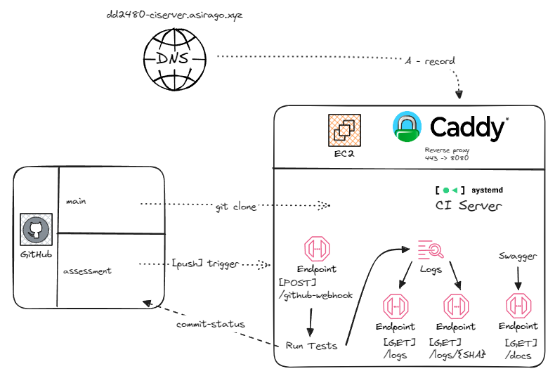

# DD2480_CI
Continuous Integration Assignment in the KTH course DD2480.

## Description
In this assignment we build a CI-server and integrate it with Github.
In the main branch we have the code for the CI-server itself, and in the assessment branch you will find the code from project 1 that we test using our on CI-server.

See the architecture diagram below for an overview of the project.

## Architecture diagram



## Services used
- Amazon EC2
- Adam's domain
- Java Spring Boot
- Caddy
- Swagger
- Maven
- GitHub Webhooks

## Instructions
To use the CI server, push any commit to the ```assessment``` branch. As tests are run on the build, the status will be updated in GitHub.

To see details of the build, click ```details``` in the commit on GitHub. Alternatively, take note of the commit ID, and access the following URL: ```https://dd2480-ciserver.asirago.xyz/logs/[commitID]```.

In order to see all previous logs, access [https://dd2480-ciserver.asirago.xyz/logs](https://dd2480-ciserver.asirago.xyz/logs). Access specific logs by clicking on them.

To see documentation on the CI server, access [https://dd2480-ciserver.asirago.xyz/docs](https://dd2480-ciserver.asirago.xyz/docs).

## Endpoints

See [Documentation Endpoints](https://dd2480-ciserver.asirago.xyz/docs).

### Health Check

- **`GET /`**: Returns the current status of the web app to check its health and availability.

### Logs

- **`GET /logs`**: Retrieves all logs generated by the web app. Displays each logged commit SHA with a link to the associated log.

- **`GET /logs/{SHA}`**: Fetches logs for a specific commit, identified by its SHA hash.

### Documentation

- **`GET /docs`**: Provides Swagger-generated documentation for the web app's endpoints. This endpoint allows for simple testing of endpoints and viewing responses.

### GitHub Webhook

- **`POST /github-webhook`**: Configured to receive events from GitHub via webhooks. This endpoint is designed to trigger actions within the web app based on push-events occurring on the assessment branch of our GitHub repository.


## Statement of Contributions
- ##### [Adam Siraj](https://github.com/asirago)
Worked on exposing port 8080 where the Java Spring Boot application is running to the internet through https with Caddy. I also worked on the `githubReceiver` function that receivess

- ##### [Emil Sjölander](https://github.com/emilsjol)
Implemented functionality regarding displaying of logs, including all logs and specific logs. Performed code review and analysis both individually and in group. Contributed to Essence analysis and documentation.

- ##### [Emir Catir](https://github.com/empazi)
Worked on displaying logs created from the webhook information. Code reviewed.

- ##### [Omar Askar Vergara](https://github.com/Omar-AV)
Worked on building and test ngthe code on the CI -serverand logging the boutcome. Code reviewed. 

- ##### [Mathias Duedahl](https://github.com/Lussebullen)
I primarily put effort into project management this time around. Initially suggesting an architecture and partitioning it into tasks that we could work on in parallel.
Exposed appropriate endpoints and implemented Swagger documentation for REST api.

## Remarkable Achievement
We exposed our CI server on a custom sub-domain using Adams already existing domain. Furthermore added automatic coercion to HTTPS using Caddy, which also handles the certificate management.
Overall we are quite proud of how smooth the project went, and how quickly we implemented new technologies with great success.

## Commit convention
All commits should be performed on the appropriate issue branch

Prefixes: ```feat/, fix/, docs/, refactor/, test/```

New since last project: use ```test/``` instead of ```feat/``` when adding tests, based on feedback from TA. Additionally, use ```docs/``` instead of ```doc/``` (notice the s).

# Essence analysis (Team)
Using the essence standard, the team is currently in the state of “Collaborating”, and is making great progress towards "Performing". All necessary bits to get the mission done have been listed and communication through our selected channels are becoming second nature. Everyone is pulling in the same direction and are acting for a good result and atmosphere in the group. In the first assignment, the work consisted of more but smaller sub-tasks, which made it easy to divide and share the workload. For the second assignment, however, fewer but more complex tasks were identified. The team handled this flawlessly by pairing up and forming smaller groups, while simultaneously using the team member's individual strengths to get the job done. 

In the performing state we do not consider the following to be satisfied “Wasted work and the potential for wasted work are continuously identified and eliminated”. In our regular follow-up meetings, our progress is reported, and potential issues are discussed, so that we can tackle problems proactively. However, no real attempts have been made to identify “wasted work” as the main focus has been on solving the problems at hand. If we could incorporate some sort of reflection on the finished work in our meetings, we could achieve the criteria of avoiding backtracking and eliminating wasted work (and move on to the next state). Additionally, there has been a small amount of reworking that perhaps could be avoided if we had planned a bit better beforehand. Since we are fulfilling our planned goals, assign and adept the group work structure according to the phase of the assignment we are in, as well as progress without external help,  we consider those parts of "Performing" to be fulfilled. By reflecting on finished work, and paying attention to avoiding potential reworking we can progress to the "Performing" stage.   
